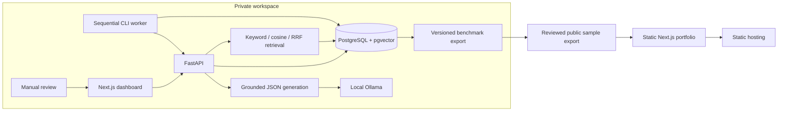

# Architecture

RAG Lab has a private experiment workspace and a separately buildable read-only portfolio. The portfolio bundles only the checked-in original CC0 sample and actual draft benchmark export. It has no runtime API, database, credentials, or inference dependency.

The snapshot bundled today contains draft labels, not human-validated results. “Reviewed public sample export” means checking content suitability for publication, not claiming dataset label review.

Ingestion validates bounded TXT/Markdown/text PDF input, preserves file hashes/page locations, and creates versioned chunks. Keyword retrieval uses PostgreSQL full-text ranking; vector retrieval uses a pinned local 384-dimensional MiniLM model, and hybrid combines ranks with RRF. Search is scoped to one document. Generation constructs whole-chunk context with citation aliases, requires structured JSON, validates source membership, and saves successful or failed query traces. Citation validation does not establish semantic support.

The CLI worker stores durable question attempts before processing and uses a PostgreSQL advisory lock to prevent overlapping workers. Restart marks interrupted runs failed. Frozen model comparisons snapshot retrieval inputs, context and actual prompt hashes, model digests, and budgets. Failed attempts remain visible. Human answer scores are separate from automated retrieval metrics.

The standard frontend calls the private API. `NEXT_PUBLIC_DEMO_ONLY=true` selects the saved demo at the root and enables static export; `/demo` is also available in the local build. Demo navigation never enters the private workspace. Client search and filtering operate entirely on the bundled snapshot. Provider weight downloads, human label validation, and production backend hosting are independent of this static presentation.
