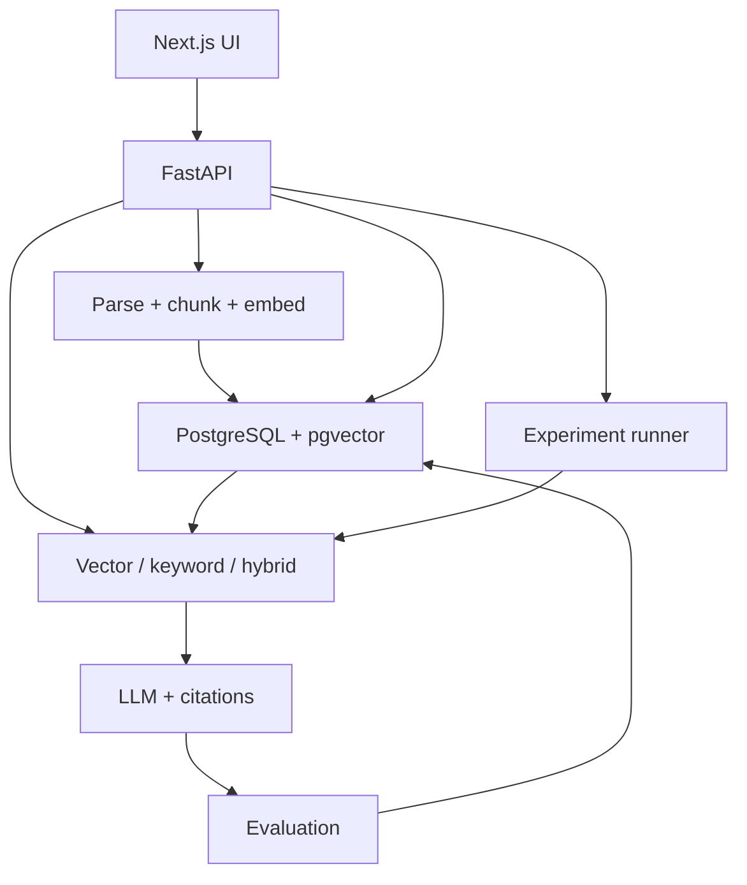

# RAG Lab — Project Plan

> An experimentation and evaluation platform for RAG systems.

**Status:** Original scope and schedule. Six implementation milestones are delivered; see README for current capabilities and outstanding human/model/hosting validation.
**Goal:** Complete a portfolio version in 10–11 days.  
**Budget:** $0, prioritizing local models and benchmarks.  
**Planned deployment:** Vercel + Supabase + a backend hosting service with a suitable free plan.

## 1. Overview

RAG Lab helps developers experiment with, evaluate, and improve Retrieval-Augmented Generation (RAG) systems.

Users upload documents, ask questions, select retrieval and model configurations, run evaluations, and compare results. The platform helps answer:

- Does retrieval find the right document chunks?
- Is the answer correct and supported by the documents?
- Does hybrid retrieval outperform vector retrieval?
- Given the same context, which model produces better answers?
- How does quality compare with latency and resource usage?
- Does an incorrect answer stem from retrieval, generation, or the evaluation dataset?

The project's portfolio value comes from **build → measure → diagnose → improve**, supported by actual measurements and reproducible methods.

## 2. Initial Scope

| Feature | MVP scope | Completion criteria |
|---|---|---|
| Document ingestion | Text-based PDF, TXT, Markdown | Parse, chunk, and index; display status and errors |
| RAG Playground | Questions against a selected corpus | Answers with citations traceable to source chunks |
| Vector retrieval | One embedding model | Return top-K chunks and similarity scores |
| Keyword retrieval | PostgreSQL full-text search | Run independently as a baseline |
| Hybrid retrieval | Combine vector and keyword retrieval using RRF | Compare against vector retrieval on the same dataset |
| Model comparison | Two configurable local LLMs | Keep context and prompt identical during comparison |
| Evaluation | 30–50 labeled questions | Store per-question results and aggregate metrics |
| Experiment comparison | Baseline and candidate | Display quality, latency, error counts, and configuration |
| Failure analysis | Per-question drill-down | Question, reference answer, chunks, generated answer, and evaluation |
| Public demo | Saved benchmarks and sample corpus | Visitors can inspect results without the local machine |
| Documentation | README and case study | Setup, architecture, methodology, and limitations |

**Later phases:** Fine-tuning, agentic RAG, Kafka, Kubernetes, OCR, arbitrary URL ingestion, multi-tenancy, and full authentication.

PostgreSQL full-text search must not be labeled BM25. Adding BM25 later requires an implementation or search engine that supports that algorithm.

## 3. $0 Budget Strategy

Separate **running experiments** from **presenting results publicly**.

### Local Development and Benchmarking

- Run LLMs on a personal computer using Ollama.
- Generate embeddings using `sentence-transformers/all-MiniLM-L6-v2`.
- Run FastAPI locally; use PostgreSQL + pgvector through Docker or Supabase.
- Run benchmarks locally, then save results for the public demo to read.
- Require neither the OpenAI API nor any paid API in the default configuration.

### Public Demo

- Vercel serves the frontend.
- Supabase stores the corpus, metadata, and experiment results.
- Backend hosting serves a lightweight API; select a plan that incurs no charges only after checking its current terms.
- Public live generation is an additional goal, dependent on an actually available free inference endpoint.
- If free inference is unavailable, the demo still supports benchmark inspection, comparison, and failure analysis; the UI clearly states that live generation is unavailable.

**Do not include fabricated benchmark figures.** A stored answer must be labeled “saved benchmark result” rather than presented as a newly generated model response.

Free plans may limit RAM, CPU, storage, or requests, or put services to sleep. Free hosting does not guarantee 24/7 availability. Deployment requires accounts and configuration for each provider and has not been performed as part of this plan.

## 4. Tech Stack

| Layer | Choice | Role |
|---|---|---|
| Frontend | Next.js + TypeScript | Dashboard, playground, and comparison |
| UI | Tailwind CSS + shadcn/ui | Components and layout |
| Charts | Recharts | Quality and latency visualization |
| Backend | Python + FastAPI | Ingestion, retrieval, queries, and experiments |
| Database | PostgreSQL + pgvector | Metadata, chunks, embeddings, and results |
| Database hosting | Supabase | Managed PostgreSQL |
| Embedding | all-MiniLM-L6-v2 | Local embeddings; 384 dimensions |
| Generation | Ollama + two models compatible with the hardware | Local LLM comparison |
| Keyword retrieval | PostgreSQL full-text search | Lexical baseline |
| Hybrid fusion | Reciprocal Rank Fusion (RRF) | Combine ranked lists |
| Evaluation | Custom Python metrics + manual labels | Retrieval and answer evaluation |
| Optional judge | Local LLM judge | Assist with scoring; requires human validation |
| Packaging | Docker + Docker Compose | Backend and local environment |
| CI | GitHub Actions | Backend tests and frontend build |

Do not finalize the two LLMs before checking the machine's RAM and processor. Start with two small models, using the same quantization where appropriate, and record model tags and configurations. Changing the embedding model requires re-indexing the corpus and creating a new version.

## 5. Architecture



**Query flow:** Select corpus → embed question → retrieve top-K → construct prompt → call LLM → return answer and citations → save trace.

**Experiment flow:** Select dataset and configuration → create run → process each question → calculate metrics → save per-question results → aggregate → compare baseline and candidate.

In the $0 configuration, embeddings and LLMs run locally. A publicly hosted backend cannot automatically access Ollama on a personal computer; public live generation requires a separate inference endpoint.

## 6. Proposed Repository Structure

```text
rag-lab/
├── apps/
│   ├── web/
│   │   ├── app/                  # Pages and layouts
│   │   ├── components/           # Tables, charts, citations
│   │   ├── lib/                  # Typed API client
│   │   └── .env.example
│   └── api/
│       ├── app/
│       │   ├── main.py
│       │   ├── config.py
│       │   ├── routes/            # documents, query, experiments
│       │   ├── schemas/           # Request/response validation
│       │   ├── ingestion/         # Parsing and chunking
│       │   ├── embeddings/        # Local embedding adapter
│       │   ├── retrieval/         # Vector, keyword, RRF
│       │   ├── providers/         # Ollama interface
│       │   ├── evaluation/        # Metrics and optional judge
│       │   ├── experiments/       # Runner and run lifecycle
│       │   └── db/                # Repository/query layer
│       ├── tests/
│       ├── pyproject.toml
│       ├── Dockerfile
│       └── .env.example
├── supabase/migrations/
├── datasets/                     # Questions and relevant chunk IDs
├── sample-corpus/                # Original or permitted documents
├── benchmarks/                   # Exports of actual results
├── scripts/                      # Seed, index, benchmark, export
├── docs/                         # Architecture and case study
├── .github/workflows/ci.yml
├── docker-compose.yml
└── README.md
```

This is a proposed structure, not a list of files already created.

## 7. Core Modules

### Ingestion

- Validate file type, size, and the amount of parsed text.
- For scanned PDFs without OCR, return an unsupported-file message rather than indexing empty text.
- Chunk by tokens or paragraphs; retain page locations and document IDs.
- Store content hashes to identify duplicate uploads.
- Record chunking configuration, embedding model, and corpus version.

### Retrieval

- Vector: cosine similarity with pgvector.
- Keyword: full-text search ranking.
- Hybrid: obtain two ranked lists, merge using RRF, and deduplicate by chunk ID.
- Save chunks, ranks, scores, and retrieval latency in the trace.

### Generation

- Use a consistent adapter to call the two Ollama models.
- Instruct models to answer only from the supplied context and use citation IDs.
- When evidence is insufficient, instruct models to acknowledge the lack of information.
- Implement timeouts, bounded retries, and checks that citation IDs belong to the supplied context.
- Valid citation IDs do not prove that an answer is correct; evaluate citation support separately.

### Experiment Runner

- States: `queued → running → completed / failed / cancelled`.
- Persist progress and per-question results; do not keep the entire run only in RAM.
- Run benchmarks through a CLI worker; the API and UI read run status.
- Sequential execution is sufficient for the MVP; Celery and Redis are unnecessary.
- Record seed, prompt version, corpus/dataset versions, and model configuration.
- After a worker restart, detect interrupted runs and either resume them or mark them with an explicit error.

## 8. Proposed Data Model and API

| Entity | Key data |
|---|---|
| Documents | ID, filename, content hash, parse status, corpus version |
| Chunks | ID, document ID, text, page, embedding, metadata |
| Datasets | ID, version, corpus version, description |
| Questions | Question, reference answer, relevant chunk IDs, category |
| Experiments | Configuration, versions, status, timestamps, aggregate metrics |
| Results | Question ID, answer, retrieved IDs, metrics, latency, error |

| Endpoint | Purpose |
|---|---|
| `GET /health` | Health check |
| `POST /documents` | Local/private upload and ingestion |
| `GET /documents` | List documents and their status |
| `POST /query` | Questions with retrieval/model configuration |
| `GET /datasets` | List benchmark datasets |
| `POST /experiments` | Create a run for the worker |
| `GET /experiments` | Run history |
| `GET /experiments/{id}` | Configuration, progress, and aggregate metrics |
| `GET /experiments/{id}/results` | Paginated per-question results |

Do not allow unlimited anonymous uploads or experiment creation. The public demo defaults to read-only access. If live queries are enabled, use the sample corpus, rate limits, input/output limits, and bounded concurrency. Database credentials remain in the backend; the frontend must not hold a service-role key. Enable RLS and restrict table access.

## 9. Evaluation Methodology

### Dataset

Choose a narrow domain, such as original technical documentation about RAG/PostgreSQL. Create 30–50 questions and manually validate their labels:

- Factual questions, specific keywords, and paraphrased questions.
- Questions requiring information from multiple chunks.
- Questions without answers in the corpus to test abstention.
- Each question includes an ID, reference answer, relevant chunk IDs, and category.

Use part of the dataset as a development set for retrieval tuning; lock the holdout set before final measurement. If each question has only one relevant chunk, clearly state that Recall@K is equivalent to hit rate. Do not assign zero Recall/MRR to unanswerable questions; evaluate abstention separately.

### Two Primary Experiments

| Experiment | Keep fixed | Change |
|---|---|---|
| Retrieval comparison | Corpus, dataset, embedding, top-K, LLM, prompt | Vector / keyword / hybrid |
| LLM comparison | Questions, retrieved chunks, prompt, output budget | Model A / Model B |

For LLM comparison, materialize the context in advance so both models receive identical content. Record temperature and hardware. If a model times out, retain the failure result instead of removing it from the sample.

### Metrics

| Metric | Measurement |
|---|---|
| Recall@K | Relevant chunks retrieved in top-K / total relevant chunks |
| MRR | Average reciprocal rank of the first relevant chunk; zero when none is found |
| Correctness | Manual rubric based on reference answers; optional judge assistance |
| Faithfulness | Check whether claims are supported by retrieved context |
| Abstention | Check whether the model correctly declines to answer when the corpus lacks evidence |
| Latency | Separate retrieval and generation timing; aggregate p50/p95 |
| Failure rate | Failed requests / total attempted requests |
| Token usage | Provider-reported counts where available; explicitly label estimates |

Do not use keyword overlap as the sole evidence of correctness. A local judge needs a rubric, recorded model/version, and comparison against at least 10–15 manually scored answers. If the judge is not reliable enough, report manual scores and do not treat judge scores as authoritative.

Do not set results in advance, such as “95% accuracy.” Record results after running experiments. With 30–50 questions, conclusions apply only to this small corpus; dataset expansion is a next step. Paired bootstrap confidence intervals are an optional addition if time permits.

## 10. UI

| Screen | Content |
|---|---|
| Overview | Document/run counts, status, and recent benchmarks |
| Documents | Upload, parse status, and chunk inspection |
| Playground | Question, model, strategy, top-K; answer and citations |
| Experiments | Dataset/configuration, run progress, and history |
| Comparison | Baseline/candidate, metric deltas, latency, and error counts |
| Failure Analysis | Reference answer, generated answer, retrieved chunks, and scoring rationale |

Style: left sidebar, dark navy/charcoal theme, blue accents, and clear typography. The Comparison screen is the main focus. Empty, loading, and error states must work; unmeasured values display “Not measured.”

## 11. Eleven-Day Plan

Assume solo development for approximately 5–7 hours per day. This is a target of around 55–77 hours, subject to hardware and integration speed.

| Day | Work | Deliverable / checkpoint |
|---|---|---|
| 1 | Repository, environment templates, FastAPI, frontend shell, database migration | Running frontend/API, health check, and database connection |
| 2 | Parse, chunk, embed, and seed corpus | Indexed sample corpus with traceable sources |
| 3 | Vector retrieval, Ollama, citations; attempt deployment of the application shell | End-to-end local query; identify hosting blockers |
| 4 | Keyword retrieval, RRF hybrid, and retrieval traces | Three strategies runnable on the same questions |
| 5 | 30–50-question dataset, manual labels, and split | Versioned dataset with validated labels |
| 6 | Runner, persistence, Recall/MRR, and latency | Actual baseline benchmark with recorded failures |
| 7 | Model comparison and correctness/faithfulness review | Two models evaluated on identical context; per-question results |
| 8 | Comparison UI and failure drill-down | Dashboard using actual data |
| 9 | Failure analysis, one improvement, and holdout re-evaluation | Case study with at least three failure cases |
| 10 | Frontend/API deployment, public read-only demo, and CI | Demo URL and working checks |
| 11 | QA, README, screenshots, demo video, and case study | Completed portfolio package within the agreed scope |

**End-of-day-3 checkpoint:** If free inference hosting is unavailable, switch the public demo to saved results and continue benchmarking locally.

**End-of-day-7 checkpoint:** If time is limited, retain the sample corpus, vector/hybrid retrieval, and evaluation. Reduce public uploads, animations, and the optional judge. Preserve validated labels, measured results, and failure analysis.

## 12. Testing

- Unit: chunk overlap, RRF deduplication, Recall/MRR edge cases, and abstention handling.
- Integration: ingestion → retrieval → result persistence; local Ollama query.
- Experiment: both models receive identical context; failures remain in the denominator.
- UI/build: TypeScript checks, production build, and loading/empty/error states.
- Deployment: health check, CORS, database benchmark reads, and no exposed secrets.
- Regression: dataset/corpus/configuration versions are fully stored and exported.

## 13. Definition of Done

- [ ] Runs locally using README instructions and environment templates without paid APIs.
- [ ] Sample corpus has clear provenance and usage rights.
- [ ] Local queries return traceable citations.
- [ ] Vector and hybrid retrieval are benchmarked on the same dataset.
- [ ] Two local models are compared using identical context.
- [ ] Includes 30–50 questions with manually validated labels.
- [ ] Actual results cover retrieval quality, answer review, latency, and failures.
- [ ] Public demo supports comparison and per-question result inspection.
- [ ] Live generation availability is clearly stated in the UI.
- [ ] Includes at least three failure cases and one measured before/after change.
- [ ] Includes CI, setup instructions, screenshots, and an architecture diagram.
- [ ] Repository contains no secrets or fabricated benchmark results.

## 14. Case Study and Resume Content

Case study structure: problem → baseline → failure cases → hypothesis → change → measured results → trade-offs → limitations.

Proposed resume bullets; fill in figures only after measurement:

> Built RAG Lab, a reproducible RAG evaluation platform comparing vector and hybrid retrieval and two local LLMs across [N] labeled questions, with per-query traces, citation inspection, and a deployed benchmark dashboard.

> Improved [metric] from [baseline] to [candidate] on a held-out dataset by [actual change], while measuring latency and analyzing retrieval and generation failures.

## 15. First Implementation Steps After Plan Approval

1. Check processor/RAM and Ollama compatibility to select two models.
2. Create the monorepo, `.env.example`, migration, and API contracts.
3. Complete one vertical slice: sample documents → indexing → retrieval → answer with citations.
4. Begin recording actual results before expanding the dashboard.

No speculative setup commands are provided as though the code already exists. The “Getting Started” section will be added and verified when the source code is implemented.
